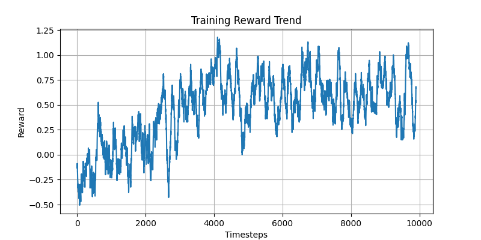

  <h1>Reinforcement Learning Chatbot Using Gradio Interface</h1>
  

    This project implements a reinforcement learning-based chatbot using a custom environment 
    and a Gradio-based user interface. The chatbot adapts its responses based on sentiment analysis, 
    reply count, and time between responses.
  

  <h2>Features</h2>
  <ul>
    <li>Reinforcement Learning-based chatbot with dynamic action selection.</li>
    <li>Custom reward function based on sentiment, reply count, and response time.</li>
    <li>Gradio interface for real-time interaction.</li>
  </ul>

  <h2>Technical Steps</h2>
  <h3>1. Setting Up the Environment</h3>
  

    The custom environment includes three state variables:
    <ul>
      <li><b>Sentiment:</b> User sentiment analysis score (0 to 1).</li>
      <li><b>Number of Replies:</b> Normalized number of user replies (0 to 1).</li>
      <li><b>Time Between Replies:</b> Normalized time difference between user replies (0 to 1).</li>
    </ul>
    A reward function incentivizes positive user sentiment, faster responses, and keeping the 
    conversation engaging.
  

  <h3>2. Training the Agent</h3>
  

    The chatbot is trained using the DQN (Deep Q-Network) algorithm:
  

  <code>
    from stable_baselines3 import DQN
    model = DQN("MlpPolicy", env, learning_rate=0.01, gamma=0.5, verbose=1)
    model.learn(total_timesteps=90000)
  </code>

  <h3>3. Integrating Gradio for Interaction</h3>
  

    Gradio is used to build an interactive chatbot interface. The key steps include:
  

  <ul>
    <li>Define a Gradio Chatbot interface to maintain conversation history.</li>
    <li>Track states like time between replies and number of replies using <code>gr.State</code>.</li>
    <li>Process user inputs through the RL model and generate dynamic responses.</li>
  </ul>
  
Sample Gradio code:

  <code>
    import gradio as gr
    with gr.Blocks() as demo:
        chatbot = gr.Chatbot()
        state = gr.State(value=0)
        reply_count = gr.State(value=0)
        submit_button = gr.Button("Submit")
        submit_button.click(
            chatbot_function,
            inputs=[chatbot, user_input, state, reply_count],
            outputs=[chatbot, state, reply_count]
        )
    demo.launch()
  </code>

  <h3>4. Testing and Evaluation</h3>
  

    Evaluate the RL agent using the following methods:
  

  <ul>
    <li>Visualize reward trends by storing rewards after each episode.</li>
    <li>Use <code>evaluate_policy</code> from Stable-Baselines3 to calculate mean reward and success rates.</li>
  </ul>
  

  <h2>How to Run</h2>
  <ol>
    <li>Install dependencies: <code>pip install stable-baselines3 gradio numpy</code>.</li>
    <li>Clone this repository and navigate to the project directory.</li>
    <li>Run the main script: <code>python ChatbotAgent.py</code>.</li>
    <li>Open the Gradio interface in your browser and interact with the chatbot.</li>
  </ol>

  <h2>File Structure</h2>
  <ul>
    <li><code>ChatbotAgent.py:</code> Main script implementing the RL chatbot.</li>
    <li><code>requirements.txt:</code> List of dependencies.</li>
  </ul>

  <h2>Future Improvements</h2>
  <ul>
    <li>Enhance the reward function for more complex user interactions.</li>
    <li>Incorporate additional user context features for personalization.</li>
    <li>Optimize training time by experimenting with other RL algorithms.</li>
  </ul>

